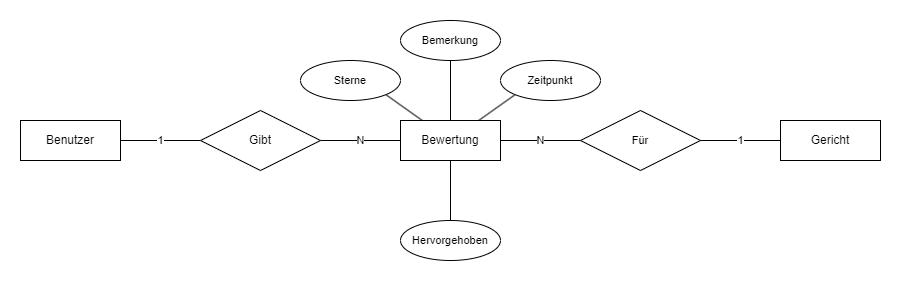

### Aufgabe 1

|         | Geschätzte Zeit | Benötigte Zeit |
|:--------|:---------------:|:--------------:|
| Henning |     20 min      |    110 min     |
| Simon   |     25 min      |    260 min     | 

#### a)



#### b)

```sql
CREATE TABLE bewertung
(
    bemerkung     VARCHAR(500)                                          NOT NULL,
    sterne        ENUM ('sehr gut', 'gut', 'schlecht', 'sehr schlecht') NOT NULL,
    zeitpunkt DATETIME DEFAULT NOW() NOT NULL,
    hervorgehoben BOOL DEFAULT FALSE                                    NULL,
    benutzer_id   BIGINT                                                NOT NULL
        REFERENCES benutzer (id),
    gericht_id    INT                                                   NOT NULL
        REFERENCES gericht (id)
)
    COMMENT 'Enthält Bewertungen von Nutzern für Gerichte';
```

#### c)

Nur eine Bewertung pro Benutzer pro Gericht.

```sql
ALTER TABLE bewertung
ADD CONSTRAINT bewertung_benutzer_gericht_unique UNIQUE (benutzer_id, gericht_id);
```

Mindestläge der Bemerkung.

```sql
ALTER TABLE bewertung
    MODIFY bemerkung varchar(500) NOT NULL CHECK (LENGTH(`bemerkung`) >= 5);
```

Durschnittliche Bewertung in der Tabelle `gericht`.

```sql
ALTER TABLE gericht
    ADD COLUMN bewertung DECIMAL(2, 1);

CREATE PROCEDURE update_bewertung(IN gericht_id int)
BEGIN
    UPDATE gericht
    SET bewertung = (SELECT AVG(sterne) FROM bewertung WHERE bewertung.gericht_id = gericht.id)
    WHERE id = gericht_id;
END;

CREATE TRIGGER bewertung_insert
AFTER INSERT ON bewertung
FOR EACH ROW
BEGIN
    CALL update_bewertung(NEW.gericht_id);
END;

CREATE TRIGGER bewertung_update
AFTER UPDATE ON bewertung
FOR EACH ROW
BEGIN
    CALL update_bewertung(NEW.gericht_id);
END;

CREATE TRIGGER bewertung_delete
AFTER DELETE ON bewertung
FOR EACH ROW
BEGIN
    CALL update_bewertung(OLD.gericht_id);
END;
```

### Aufgabe 2

|         | Geschätzte Zeit | Benötigte Zeit |
|:--------|:---------------:|:--------------:|
| Henning |     30 min      |     60 min     |
| Simon   |      x min      |     60 min     | 

### Aufgabe 3

|         | Geschätzte Zeit | Benötigte Zeit |
|:--------|:---------------:|:--------------:|
| Henning |     30 min      |     50 min     |
| Simon   |      x min      |     50 min     |

### Gesamt Aufwand

|         |  Benötigte Zeit   |
|:-------:|:-----------------:|
| Henning |      220 min      |
|  Simon  |      370 min      |
|         |                   |
| Gesamt  | 590 min = 9.83std |
